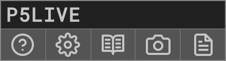
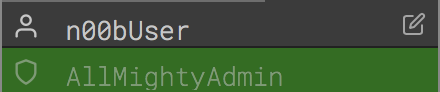
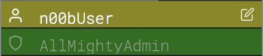
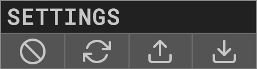

# P5LIVE
v 1.2.5  
cc [teddavis.org](http://teddavis.org) – 2019  
p5.js collaborative live-coding vj environment!


## SHORTCUTS (default)
- `CTRL + N` » new sketch
- `CTRL + ENTER` » softCompile
- `CTRL + SHIFT + ENTER` » hardCompile
- `CTRL + A` » autocompile toggle
- `CTRL + E` » editor toggle
- `CTRL + M` » menu toggle
- `CTRL + T` » tidy code
- `CTRL + SPACE` » autocomplete
- `CTRL + R` » references toggle
- `CTRL + C` » cursor toggle
- `CTRL + -` » decrease fontsize
- `CTRL + +` » increase fontsize
- `CTRL + S` » save png [ + code ]
- `CTRL + I` » 720*720px popup for screen-recording
- `CTRL + 1, 2, 3...0` » load first 10 sketches


## SAVING
Sketches are ONLY saved in your browser's localStorage so export all sketches regularly! Clearing browser history/data will likely erase all sketches.  

This means sketches are isolated to the localStorage per domain:port, so export/import all sketches to migrate between online/offline/browsers.


## INSTALL
Online: [p5live.org](https://p5live.org)

Offline: [Github Repo](https://github.com/ffd8/p5live)   
Details below to run via python webserver or nodejs/npm.


## GETTING STARTED
### LIVE-CODE IN 5... 4... 3...  
  

- Create New Sketch via GUI icon or `CTRL + N` and start coding!  
- Live-coding active by default, `CTRL + ENTER` to force recompile.  
- Sketch is auto-saved on every keystroke.  
  
## MENU
### P5LIVE MENU  
  

- About, what you're reading now.  
- Settings, adjust editor settings + shortcuts (see details below).  
- Reference, `CTRL + R`, toggle p5.js reference list.  
- Save PNG + CODE, `CTRL + S`, exports output image [and snapshot of code].  
- Save HTML, export single-page website (re-link path to custom assets).

### COCODING MENU  
  

- Start, click the single 'network' button.  

  

- Exit, click the green 'network' button.  
- Share, click copy URL and share with friends.  
- Clone sketch, saves current co-code to local sketches within session folder.  
- Lockdown (admin), limit editing, toggling privledges per user.  
- Broadcast (admin + lockdown), sync mouseX/Y/frameCount with users.

  

- Rename, click on your name (very top) to select a new nickname and cursor color.

#### Lockdown (user)
  

- Request Write-access, click edit button and wait for admin to allow.

#### Lockdown (admin)
  

- Request Deny/Accept, reject or grant write-access from users.

  

- Toggle Write-access, admin can always toggle write access of user.  
  
### SKETCHES MENU 
  

- New sketch.  
- Clone sketch, duplicates active sketch.  
- New folder, nest sketches/folders within others.  
- Import, select JSON files from export (single/folder/all).  
- Export, exports entire sketches list for import/backup.  
  
#### Filter
  
  

Lost the overview of your sketches? Just type in keywords to match names of folders or sketches to filter and only show those results. To organize them, create a new folder with that word in the title and you can drag + drop them into it. 

#### Sketch  
  

- Load, click on sketch name.  
- Inspect, click lines icon to view/edit code as popup.  
- Rename, click pencil icon and type new name.  
- Export, click download icon to export sketch as JSON file.  
- Remove, click trash icon and confirm deletion.  
- Sort, click + hold + drag to desired order.  
- Add to folder, careully drag + drop into/over folder.

#### Folder  
  

- Expand/collapse, click on folder name.  
- Rename, click pencil icon and type new name.  
- Export, click download icon to export entire contents as JSON file.  
- Remove, click trash icon and confirm deletion.  
- Sort, click + hold + drag to desired order.  
  
### SETTINGS PANEL  


- Completely reset P5LIVE (deletes all sketches!)
- Reset Settings to defaults
- Import Settings
- Export Settings
  
### Settings
- Live Coding, (auto-compiling mode), recompiles on error-free keyup.  
- Eco Render, toggle loop()/noLoop() if browser window is inactive.  
- Cursor, toggle visibility of cursor when hiding editor.  
- Console, toggle visibility of console incase of errors/warnings.  
- Menu Tab, toggles menu tab. (hide if visible while VJ'ing). 
- Snapshot Code, export current code with every image snapshot. 
- Line Numbers, toggle code editor gutter features + line numbers. 
- Autocomplete, toggle constant autocomplete suggestions. 
- Lock Code on Drag, toggle locked code editor on mouse drag. 
- Code Size, adjust font size of editor text.  
- Code Background, toggle + set color behind each line of code.  
- Theme, select custom styling of code.

### Shortcuts
Shortcuts can be customized by clicking on name, then pressing new key combination.  

## DETAILS
### COMPILING
There are two modes of compiling in P5LIVE:  

- softCompile, `CTRL + ENTER`, (default) replaces changed functions (smooth refresh).  
- hardCompile, `CTRL + SHIFT + ENTER`, forces entire sketch to recompile.  

Changes to global variables and `setup()`/`preload()` automatically perform a hardCompile since the entire sketch needs it. If your change only occurs within the `draw()` and custom functions (that aren't used in `setup()`), you should see a smooth transition. This is especially useful if using preloaded assets or drawing without a background during a performance, as it allows things to keep flowing. `Classes` are also softCompiled, but remember that each instance will still hold the old variables/methods, so replace each instance as needed (you'll see the updates on each new copy).  

If in doubt or not seeing changes, run a hardCompile, `CTRL + SHIFT + ENTER`. 
	
### AUTOCOMPLETE
Custom autocomplete with p5.js functions and constants has been implemented.  

To activate, enter the first few characters of a function and press `CTRL + SPACE`, then select function alone or with parameters. If selecting with parameters, use `TAB` to cycle through each one.  

If you forget the name of a function, simply view the p5.js references `CTRL + R`.
	
### SNIPPETS  
Add custom snippets to '/includes/demos/P5L_snippets.json'.  
Load snippet via shortcut, `CTRL + SHIFT + key`  

- `CTRL + SHIFT + A`, adds audio-reactive code.  
- `CTRL + SHIFT + O`, adds OSC communication code.

### LIBRARIES
P5LIVE loads p5.js/p5.dom/p5.sound libraries by default. For additional libraries, there's an experimental mode for loading external [CDN hosted](https://www.jsdelivr.com/) javascript files (or local if running offline). Use the following syntax at the top of your sketch, placing each link into the following array:  

```
let loadScripts = [
	"", 
	""
];
```

### ASSETS
Want custom assets (fonts/images/...)?   
Load from a CORS friendly webserver (ie. [imgur](https://imgur.com) for images), or better yet,  
Clone/download from GitHub and run locally.  
Drop files into folder and link relatively, ie: `loadImage('data/fish.png');`

### EXPORT / IMPORT
Beyond exporting all sketches regularly (backup!) – you can export single sketches and/or entire folders (click the export icon next to their name). To re-import, click the import button in the Sketches panel or drag and drop the `P5L_***.json` file into the browser window.

### PERFORMANCE
Lagging or retina display creates too large of a canvas?  
Use `pixelDensity(1);` in `setup()`.

### OSC/MIDI
OSC is implemented when running locally using node.js/npm.  
Load *osc_setup* demo and run Processing sketch, [p5live\_osc\_setup](https://gist.github.com/ffd8/f9f33cc7461f8467f62d5a792dde53ca)  
or use the OSC snippet (`CTRL + SHIFT + O`) and adjust in/out ports within the setup.  
MIDI is implemented with webmidi.js – see *midi_setup* demo.

### BUG/CRASH?! 
Infinite loop? Broken code?  

- Add `#bug` to URL and refresh URL to stop compiler to fix a bug/infinite-loop...  
- Add `#new` to URL and refresh URL to force a fresh blank sketch. Then you can inspect and fix broken sketch.


### FUNCTIONS
Additional custom functions are available in every sketch:  

- `frameCount`, `mouseX`, `mouseY` are continous per recompile for smooth refresh.  
- `ease(inValue, outVariable, easeValue)`  smooth values.  
- `println(foo)` Compatibility with Processing.  


## OFFLINE SERVER
### Basic webserver using Python (without COCODING/OSC):  
- Clone / Download [P5LIVE](https://github.com/ffd8/p5live)  
- MacOS – open `Terminal` // Windows – open `command prompt`  
- type `cd` + `SPACEBAR` + drag/drop P5LIVE folder into window, press `ENTER` 
- check Python version, type `python --version`, press `ENTER` 
	- `Python 2.0+`, type `python -m SimpleHTTPServer 5000`, press `ENTER`    
	- `Python 3.0+`, type `python -m http.server 5000`, press `ENTER`    
- goto [http://localhost:5000](http://localhost:5000)
- To quit, `CTRL + C` in Terminal (or command prompt)

### Fancy webserver using nodejs/npm (with COCODING/OSC):  
- Clone / Download [P5LIVE](https://github.com/ffd8/p5live)  
- Install Node.js + NPM ([official guide](https://docs.npmjs.com/downloading-and-installing-node-js-and-npm) / [binary installers](https://nodejs.org/en/download/))  
- MacOS – open `Terminal` // Windows – open `command prompt`  
- type `cd` + `SPACEBAR` + drag/drop P5LIVE folder into window, press `ENTER`  
- type `npm install`, press `ENTER`  
- type `npm start`, press `ENTER`  
- goto [http://localhost:5000](http://localhost:5000)
- To quit, `CTRL + C` in Terminal (or command prompt)


## TOOLS USED
P5LIVE is possible thanks to these amazing open-source projects:  

- [p5.js](https://p5js.org), magic – v0.10.2
- [ace editor](https://ace.c9.io), code editor on top
- [peeredit / rga.js](https://github.com/jorendorff/peeredit), syncing text for cocoding
- [socket.io](https://socket.io/), websockets for cocoding
- [sortablejs](https://github.com/SortableJS/Sortable), drag + drop sorting of sketches/folders
- [beautify](https://github.com/beautify-web/js-beautify), tidy code in editor
- [pickr](https://github.com/Simonwep/pickr), color picker
- [tippy](https://atomiks.github.io/tippyjs/), tooltips
- [download.js](http://danml.com/download.html), exporting html file
- [vex](https://github.com/HubSpot/vex), custom dialog boxes
- [marked.js](https://github.com/markedjs/marked), parsing this readme into about
- [Roboto Mono](https://github.com/google/roboto), font
- [Feather Icons](https://feathericons.com), gui icons 
- [loading.io](https://loading.io/css/), css spinning intro loader
- [glitch.com](https://glitch.com), nodejs websocket hosting
- [p5js-osc](https://github.com/genekogan/p5js-osc/), osc connection
- [WebMidi.js](https://github.com/djipco/webmidi), midi connection
- [dropzone.js](https://www.dropzonejs.com/), drag + drop importing
- [mousetrap.js](https://craig.is/killing/mice), custom shortcut key bindings


## INSPIRATION
- [cyril](https://github.com/cyrilcode/cyril)
- [Hydra](https://github.com/ojack/hydra)


## SOURCE
- [GitHub](https://github.com/ffd8/p5live)