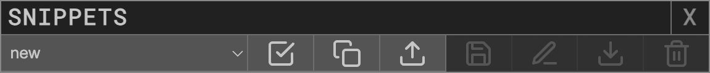
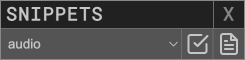
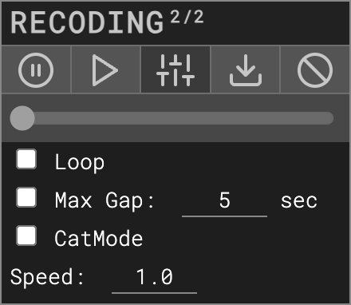

# P5LIVE
v 1.6.3  
cc [teddavis.org](http://teddavis.org) – 2019 - 2024  
p5.js collaborative live-coding vj environment!

## SHORTCUTS
### P5LIVE (default)
|  |  |
|--:|:--|
|`CTRL` + `ENTER`|softCompile|
|`CTRL` + `SHIFT` + `ENTER`|  hardCompile |
|  `CTRL` + `E` |  editor toggle |
| `CTRL` + `N` | new sketch |
| `CTRL` + `SHIFT` + `C` | clone sketch |
| `CTRL` + `A` | autocompile toggle |
| `CTRL` + `,` | settings toggle |
| `CTRL` + `R` | references toggle |
| `CTRL` + `B` | chalkboard toggle |
| `CTRL` + `T` | tidy code |
| `CTRL` + `SPACE` | autocomplete |
| `CTRL` + `+` | increase fontsize |
| `CTRL` + `-` | decrease fontsize |
| `CTRL` + `S` | save png [ + code ] |
| `CTRL` + `1, 2, 3...0` | jump to first 10 sketches |
| `CTRL` + `SHIFT` + `⇡⇣` | jump to previous/next sketch |  
| `CTRL` + `SHIFT` + `DELETE` | delete current sketch |

*Customize shortcut keys within the `Settings` panel*

### Ace Editor
|  |  |
|--:|:--|
|`ALT` + `UP/DOWN`|shift lines up/down|
|`META` + `ALT` + `UP/DOWN`|duplicate lines up/down|
|`META` + `D`|delete line|

*(META = CMD on MacOS, CTRL on Windows/Linux)*

## GETTING STARTED
### LIVE-CODE IN 3... 2... 1...  
  

-  Create New Sketch or `CTRL + N` and start coding!  
- Live-coding active by default, `CTRL + ENTER` to force recompile.  
- Sketches are auto-saved to localStorage on every keystroke.  

## INSTALL
Online »  [p5live.org](https://p5live.org)  
Offline » [github.com/ffd8/p5live](https://github.com/ffd8/P5LIVE#offline-mode) *(or see below for instructions)*

## SAVING
Sketches are **_ONLY_** saved in your browser's localStorage(!).  
Export all () sketches + settings regularly.  
Clearing browser history/data will likely erase all sketches + settings.

localStorage is unique and isolated per http[s] / domain / port,  
so export/import all sketches to migrate between online / offline / browsers.  
Simply use `Settings Panel`» `Backup` » `Now` to export all settings + sketches.

#### Automatic Backups
See `Settings Panel` » `Backup` to automatically export a P5LIVE backup file at varying intervals. If using [Offline Server](https://github.com/ffd8/P5LIVE#offline-mode), it will save these backups to your `P5LIVE/_backups` folder rather than downloads.

## MENU
### P5LIVE PANEL 
  

-  About, 👋 you're reading me now.  
-  Settings, adjust editor settings + shortcuts.  
-  Reference, `CTRL + R`, toggle embeded p5.js reference.  
-  Chalkboard, `CTRL + B`, toggle chalkboard over for annotations.  
-  Popup Stream, hover for visuals/code as separate outputs:  

&nbsp;&nbsp;  

&nbsp;&nbsp;-  Visuals-only popup.  
&nbsp;&nbsp;-  Code-only popup.  


-  Export, hover for submenu options:  

&nbsp;&nbsp;  

&nbsp;&nbsp;-  Save .png, `CTRL + S`, image (+ code if active in settings).  
&nbsp;&nbsp;-  Share code as URL (links to online version at p5live.org).  
&nbsp;&nbsp;-  Save .html, single page website (re-link asset paths).

### SETTINGS PANEL  


-  Reset Settings to defaults
-  Import Settings
-  Export Settings
  
#### Options
- [x] Live Coding, [500ms], auto-compile error-free code on keyup, with set delay.  
- [x] Console, display console messages, [auto/show] to hide or keep visible.  
- [x] Eco Render, noLoop() if window loses focus (save computer resources).  
- [x] Menu Tab, toggle menu tab. (hide if visible while VJ'ing). 
- [x] Snapshot Code, export current code with each image snapshot. 
- [x] Line Numbers, display code line numbers (and gutter features). 
- [x] Recompile Pulse, flash compiled section of code. 
- [ ] Auto Autocomplete, useful for learning, or use `CTRL + SPACE` on demand. 
<!--- [x] Lock Code on Drag, locks code editor on mouse drag to prevent displacing code. (temp remove)-->
- [ ] Pass Editor Keys, keypresses from editor to p5 canvas (hide editor otherwise).
- [x] Notifications, display notifications (shortcut settings + chat). 
- [x] Tooltips, displays extra info on hover. 
- [x] Multi-P5LIVE Warning, if opened multiple times can lose sync of sketches. 
- [x] Timestamp Exports, adds _YYYYMMDD_HHMMSS to filenames.  
- [ ] COCODING Flags, show cursor flags or only with mouseover userlist.  
- [x] COCODING Autosave, autosave session code if server/internet lost.  
- [x] Check Updates, check Github for updates (offline-mode only).  
- Backup, [off], saves/downloads P5LIVE (sketches + settings) at intervals. `Now` - on demand. *Set to `Daily` in offline-mode*.  
- Code Size, `15pt` adjust font size of editor.  
- Theme, [Green on Black], select custom styling of editor.
- [x] Background, toggle + set color behind lines of code.  
- [x] Text, toggle + override unstyled text in code.  
- [x] Active-line, toggle + set active-line color.  
- Keybinding, [ace], select alternative keybindings of editor.
- Snippets, `Launch Editor`, to open snippets editor.
- [ ] SoniCode, plays oscillator/midi on every keystroke. 

#### SoniCode
Want to sonify your coding process?! Activate this toggle to generate sounds based on every keystroke (mapping keyCode to sample note). There are built in oscillators, however one can also select `midi` to send midi notes (channel 1) out to a DAW of choice for more complex samples.

#### Shortcuts
Customize keyboard shortcuts by clicking on name + press a new key combination.  

#### Reset P5LIVE
-  Completely reset P5LIVE = *deletes all sketches + settings!*  
Don't forget to export sketches first.

### COCODING PANEL
  

See dedicated COCODING section below for details.

### RECODING PANEL
  

See dedicated RECODING section below for details.

### SKETCHES PANEL 
  

-  New sketch.  
-  Clone sketch, duplicates active sketch.  
-  New folder, nest sketches/folders within others.  
-  Import, select JSON files from export (single/folder/all).  
-  Export, exports entire sketches list for import/backup.  
  
#### Filter
  
  

Lost the overview of your sketches?  
Type in keywords to match names of sketches and folders, filtering only those results. Use separate words for an *and* search, ie. `3d webgl text`. To organize, add a new folder containing that word, and drag + drop items into it. 

Optionally, toggle `<>` to search through source code of all sketches.

#### Sketch  
  
  

- Load Sketch, click on name.
- Click on loaded sketch (green) to rename.
-  Hover to view contextual options  
	-  Inspect,  view/edit code as popup.  
	-  Rename, give sketch new name.  
	-  Export, export single sketch as JSON file.  
	-  Remove, delete sketch after confirmation.  
- Sort, click + hold + drag to desired order.  
- Place in folder, slowly drag + drop into/over folder.

#### Folder  
  
  

- Expand/collapse Folder, click on name.  
-  Hover to view contextual options  
	-  Rename, give folder new name.  
	-  Sub-sketch, create a new sketch within existing folder.	-  Sub-folder, create a new folder within existing one.
	-  Export, export folder + contents as JSON file.  
	-  Remove, delete folder + contents after confirmation.  
- Sort, click + hold + drag to desired order.  

### ISSUES
#### LAG
Lagging or retina display creates too large of a canvas?  
Use `pixelDensity(1);` in `setup()` to prevent retina scaling.

#### BUG/CRASH?! 
Infinite loop? Broken code? P5LIVE now includes an infinite loop breaker, thus rendering previous tricks more or less obsolete... nevertheless, these may still be useful:

- Add `#bug` to URL and press `ENTER`.  
Stops compiler, loads a new sketch and opens inspector to fix issue and save.
- Add `#new` to URL and press `ENTER`.  
Loads a new sketch.
- If the browser has completely hung, (rare [old ~2020] issue between MBP/Chrome/libraries)  
`sudo killall coreaudiod` (first take off headphones + turndown stereo!)

*Incase you need a loop to run more than 10000 times ||  1 second,  
add `// noprotect` anywhere in your code to override 'loopBreaker'.  
(not possible during COCODING sessions to protect peers)*
  
## FEATURES
### COMPILING
There are two modes of compiling in P5LIVE:  

- softCompile, `CTRL + ENTER`, (default) replaces changed functions (smooth refresh).  
- hardCompile, `CTRL + SHIFT + ENTER`, forces entire sketch to recompile.  

Changes to global variables and `setup()`/`preload()` automatically perform a hardCompile since the entire sketch needs it. If your change only occurs within the `draw()` and custom functions (that aren't used in `setup()`), you should see a smooth transition. This is especially useful if using preloaded assets or drawing without a background during a performance, as it allows things to keep flowing. `Classes` are also softCompiled, but remember that each instance will still hold the old variables/methods, so replace each instance to see changes. 

A recompile when nothing has changed (and `live-coding` active), triggers a hardCompile, which is useful for clearing the background or class instances.

If in doubt or not seeing changes, run a hardCompile, `CTRL + SHIFT + ENTER`. 

`frameCount`, `mouseX`, `mouseY` are continous per recompile for smooth refreshes.
	
### AUTOCOMPLETE
Custom autocomplete with p5.js functions and constants has been implemented!  

  

To activate, enter the first few characters of a function and press `CTRL + SPACE`, then select function alone or with parameters. If selecting with parameters, use `TAB` to cycle through each one. Optionally activate `Auto Autocomplete` in the `Settings` to have suggestions on every keystroke.  

The auto-compiler of `live-coding` pauses whenever the auto-complete panel is active.

If you forget the name of a function, simply view the p5.js references `CTRL + R`.

### REFERENCES
After an overhaul, the built-in  `References`, `CTRL + R`, now include nearly all information found on the official [p5.js reference website](https://p5js.org/reference/), embedded for easy lookup while potentially VJ'ing... meta-visuals! Use the   to surprise yourself and view a random reference.

  

Use `Search...` with keyup instant filtering to find functions you're after.  
Separate words for an *and* search, ie. `material light`.  
References keep full opacity once viewed, helping note which ones you've read. 

  

Hover over functions for `parameters` tooltip, click to read the full detailed reference. 

  

Beyond params and descriptions, the example's code is now embedded with js highlighting.

### CHALKBOARD
Teaching a class with P5LIVE and need to explain a mathematical concept or highlight code?  
Toggle a  Chalkboard from the P5LIVE Panel or shortcut `CTRL + B`.


Use `DRAWINGS` pulldown to activate 1 of 10 isolated layers to draw on. All drawings remain until either pressing the `🗑️` clear button, DELETE key or refreshing the page. Toggle between `✏️ DRAW` / `🔤 TEXT` / `🧽 ERASE` to do exactly that. In `Text` mode, DELETE removes one character at a time, allowing you to rubber-stamp text. Adjust `COLOR`, `WEIGHT`, `OPACITY` of the *CHALK*, separately adjust the `COLOR` and `OPACITY` of the board (background). This enables you to completely cover up the editor/visuals below for explaining concepts. Dim the *BOARD* if annotating or highlighting code (dim opacity of *CHALK*).

You can even access the drawings within your p5 sketch!  

```
p5live.chalkboard() // grabs active drawing
p5live.chalkboard(#) // grab specific drawing (0 – 9)
p5live.chalkboard(frameCount * .25) // cycle all ten (% in backend!)
```
This drawing can then be displayed and played with as a manual drawing layer within your sketch:

```
image(p5live.chalkboard(), 0, 0);
```
For examples, see `DEMOS` » `_CANVAS` » `_canvas_chalkboard` + `..._animation`


### SNIPPETS  
Snippets allow automatically adding chunks of code to your sketch within specific areas: global space, setup, draw – so you can quickly incorporate the necessary code for repeated workflows. Previously it was manually added to a .JSON file, but now there's a snippet editor built it!

#### Shortcuts
- `ALT + SHIFT + S`, toggle Snippets Editor, *create, modify*.  
- `CTRL + SHIFT + S`, toggle Snippets Selector, *apply*.
- Use arrow keys, tab, enter to apply snippets by keyboard only.

*Default shortcut keys can be customized within `Settings`*

#### Snippet Editor
  

- `Select` snippet to edit or 'new' to create a new one
-  Apply selected snippet.
-  Clone snippet, ie, 'Save As...'.
-  Import an exported snippet.
-  Save changes to a custom shortcut.
-  Rename a custom shortcut.
-  Export a custom shortcut.
-  Delete a custom shortcut.

#### New Snippet
- Toggle `Snippets Editor`.
- Select 'new' to create a new snippet.
- Add code within the global top, setup bottom, draw top, draw bottom, global bottom
-  `Clone Snippet` and give a custom name to save snippet.

#### Snippet Selector
  

- `Select` snippet to apply.
-  Apply selected snippet.
-  Edit selected snippet.

When performing, this can be down entirely with the keyboard, `CTRL + SHIFT + S` to toggle the Snippet Selector, `down/up arrowkey` to select a preferred snippet, `tab` to move focus to the 'Apply Snippet' button, `Enter` to activate that button.

#### Ace Snippets
Ace Editor also has the ability to have autocomplete snippets of code blocks. To activate, type one out (can also use auto-complete to help you), then press `tab`. The following have been implemented (eventually a custom editor may be added to settings):

- `libs`, inserts code for loading external libraries.
- `p5`, adds p5 template incase removed
- `hydraonly`, replace all code with this to only use hydra-synth
- `sandbox`, adds //sandbox start/stop for eval hydra code
- `hy5`, load HY5 library and sandbox for hydra code
- `hy5-p5-hydra`, template for sending p5 into hydra
- `hy5-hydra-p5`, template for sending hydra into p5
- `hy5-hydra-p5-x4`, template for sending 4x hydra tex to p5
- `hy5-hydra-p5-x4-demo`, demo for sending 4x hydra tex to p5
- *read-only `/includes/utils/ace-snippets.js` for full list*

### LIBRARIES
P5LIVE loads p5.js + p5.sound libraries by default. For additional libraries, load them remotely via [CDN host](https://www.jsdelivr.com/) or locally if running offline (ie. create `/data/libs/`). Can also be used within `SyncData`!  

Add this snippet to the top of your sketch, placing one path per array item:  

```javascript
let libs = [
	""
	,""
];
```

#### <span style="text-decoration:line-through">p5 or p5.sound</span>
To exclude libraries `p5.js` (ie. testing other versions) or `p5.sound` (ie. for Tone.js), add `//no p5` or `// no p5sound` anywhere in your code.  
See `_audio_gen_tonejs` demo for an example.

### SANDBOX
Sometimes you want to adjust global JS code that won't cause p5.js to recompile, ie. [hydra-synth](https://github.com/ojack/hydra-synth). To do so, write such code within 2x `// sandbox` comments. Any changes within that space are processed using `eval()`, however won't trigger a P5LIVE hardCompile.

#### HYDRA
The main use case for this, is [hydra-synth](https://github.com/ojack/hydra-synth), which is included within the P5LIVE libs.  
After importing the library, any changes made within the following tags:  

```js
// sandbox - start
osc().out() // ... your hydra code here
// sandbox - stop
```
– will only affect the hydra-synth engine and won't trigger p5.js recompiles!  
See `DEMOS » HY5` + `DEMOS » _HYDRA` for additional examples.

### ASSETS
Loading custom assets (image/font/obj/audio/...):  

- Remotely from a [CORS](https://enable-cors.org/resources.html) friendly server ([imgbb](https://imgbb.com/)/[glitch.com](https://glitch.com) images/videos, [GitHub](https://github.com) raw for ~anything)  
`loadImage('https://i.imgur.com/ijQzwsx.jpeg');`
- Locally, if running offline-mode create a `/data` folder  
`loadImage('data/images/fish.png');` (don't add anything to `/includes`!)

### VIEW ONLY MODE
By special request (P5LIVE for remote meditation sessions?!), there's a `view only mode`, meaning everything is hidden (code + menu) and you'll only see the sketch running. Intended for COCODING sessions, where the admin can live-code while attendees enjoy and optionally interact with the visuals using their own mic or mouse. Anytime code is recompiled, the same happens here too. Add `edit=0` to your URL:  
- COCODING, `/?cc=*****&edit=0`  
- Solo, `/?edit=0`

Similarly you can also use `?readonly=1`, for a readonly editor.  
Incase of exhibit, use `?exhibit=1`, to disable links.  

You can also load a sketch by URL (for media installation), just add `sketch=name_of_sketch` !  
Example: [\_meta\_P5LIVE](https://p5live.org/?sketch=_meta_P5LIVE)

### STREAM POPUP
Incase you want to project or stream the visuals or code only (as separate windows) from P5LIVE, press  within the P5LIVE Panel to launch popups with a video feed of your P5LIVE canvas or a separate text-editor of code. 

#### Visuals-Only Stream
This is also great for PIP if running multiple instances of offline-mode. You can also select which canvas to stream (if multiple are present, ie, HY5) and set the object-fit mode for some scaling/stretching issues.

#### Code-Only Stream
The popup editor is read/write, so be careful while typing, as all keypresses are saved. It lacks fancy P5LIVE shortcuts/snippets etc – as it's more intended as a separate projection of what you are doing in main window (same editor style, theme, position, pulse of main code).

### EXPORT / IMPORT
Beyond exporting all sketches regularly (**_backup!_**) – you can export single sketches and/or entire folders (click the export icon next to their name). To re-import, click the import button in the Sketches panel or simply `drag + drop` the `P5L_*****.js`/`P5L_*****.json` into the browser. Single sketches are now imported and exported as plain .js for embedding anywhere. 

See `Settings Panel` » `Backup` to automatically export a P5LIVE backup file at varying intervals.  

### MIDI/OSC
#### MIDI
MIDI works online + offline and is implemented with webmidi.js via p5live-midi.js utility (now built-in, no need for loading libs)  
See examples, *demos/_input/_input_midi*  

New (v1.6.0+) is a parser of all incoming midi notes + control changes, per channel and eased, for quick access.  To begin, add the following code lines to setup() and draw():   
	- setup(): `setupMidi(0, 0, true) // (in, out, globalVars)`  
	- draw(): `updateMidi()`

Technically the midi class sits behind a scope of `midi5`, however when making globalVars true (suggested), then you have access to the following variables without anything infront:  

```js
note // latest note {on, channel, number, velocity, velocityEase, sum}
cc // latest controlchange {channel, number, value}
notes[] // array of 128 notes (regardless of channel)
ccs[] // array of 128 controlchanges (regardless of channel)
channels[] // array of 16 channels {id, channel, notes, ccs}
	.note // latest note on channel
	.cc // latest controlchange on channel
	.notes[] // array of 128 notes (per that channel) {*same as above*}
	.ccs[] // array of 128 controlchanges (per that channel) {*same as above*}
```
Basic example:  

```js
updateMidi()
background(cc.value * 2) //  set BG from latest control change
circle(width / 4, height / 2, note.vel) // latest note (any ch)
circle(width / 2, height / 2, channels[0].note.vel) // latest note (ch 1)
```

For more advanced use, you can overwrite the event functions when a note is played or control change made. See *demos/_input/_input_midi_custom* for details. Essentially you decide what happens when a *noteon* occurs:  

```js
// set custom midi functions
midi5.noteOn = (note) => {
	// print(note) // {on, channel, number, velocity, velocityEase, sum}
	
}
```

#### OSC
OSC only works offline and automatically creates an OSC server.  
For example, see  *demos/_input/_input_osc* and run Processing sketch, [p5live\_osc\_setup](https://gist.github.com/ffd8/f9f33cc7461f8467f62d5a792dde53ca)  
or use the OSC snippet (`CTRL + SHIFT + O`) and set host/in/out ports.  

### EXTRA FUNCTIONS
Additional custom functions are available in P5LIVE sketches:  

- `ease(inValue, outVariable, easeValue)`  smooth values.  
- `println(foo)` Compatibility with Processing.  
- `windowResize()` keeps your sketch fullscreen by default. To disable, add `windowResized = null;` in the setup() or overwrite with custom function.
- `p5live.code` returns string of current code editor for meta usage.


## COCODING 
Use COCODING to code together friends locally and remotely! The code is synced while the visuals are rendered locally. *If the remote server isn't working, please make an issue on Github!*

#### COCODING PANEL DETAIL
  

-  Press to start a COCODING session and share new URL with friends.  

  

- COCODING <sup>#</sub> of users - ⇡⇣ syncing up/down-stream.
-  Exit, click the green 'power' button.  
-  Clone sketch, saves current co-code to local sketches within session folder.  
-  SyncData, custom code to sync local data (mouse, midi,...) with peers.  
-  Lockdown (admin), limit editing, toggle write privledges per user.  
-  Broadcast (admin + lockdown), sync mouseX/Y/frameCount/recompile with users.

  

- Click on your name (very top) to select a new nickname and color.
- If  admin left, you'll have option within this panel to claim it.

#### Lockdown (user)
  

- Request write-access, click edit button and wait for admin to allow.

#### Lockdown (admin)
  

- Grant write-access, toggle requested write-access from glowing users.

  

- Toggle write-access, admin can always toggle write access per user. 

#### Chat
   

Within chat, links are parsed, ie. share sketch from p5.js editor.  
Incoming chats displayed as notification (if active) when menu is hidden.

#### SyncData
  

 launches SyncData window.  

   

Use the SyncData window to send local data (as objects), by entering custom code that's executed locally in parallel to the shared COCODING session. Latest changes to the SyncData editor are stored in your local settings. Selecting a new preset replaces its contents, so use `Save Preset` to store anything long-term.  

**Presets**  

- `template` guide for making your own.  
- `mouseXY`, `facetracker` + `midi`, shares those signals with others.  
Be sure to enter unique `userID`'s.
- `Save Preset` for storing current SyncData editor (pre-existing name replaces it).
- `Remove Preset` is available after selecting a custom preset.

**Buttons**  

- `► RUN` activates SyncData, injecting code at end of COCODE on each recompile.
- `► RE-RUN` updates any changes made within SyncData editor.
- `↓ COCODE` (admin) adds code following `/* 2 - COCODE */` into COCODING session.
- `◼ STOP` deactivates SyncData (stops adding local code to recompile).

 

When active, your own  turns green, along with any user who is sending data.  
 Lockdown mode, suspends SyncData for all users, unless given write-access.  

All data sent, uses `parseData()` in COCODING session to access it. Events can be fired immediately, or pass values to global vars for use within `draw()`. Furthermore you can use `getData()` within COCODING session, for unique local processing within your own SyncData window and code. See `midi` preset for use-case, where `midiThru` receives incoming signals and passes them onward to your own gear.

Be kind to your peers, keep data size and intervals within reasonable values.  
Have fun COCODING with keyboards, EEG-headsets, eye-trackers, ....?! 


## RECODING 
#### RECODING PANEL DETAIL
  

-  Press to start a RECODING session and record your live coding process.  

  

**RECODING PANEL**  
- RECODING <sup>#/#</sub> step of steps in recording.  
-  /  Pause/Continue recording.  
-  /  Play/Pause playback.  
-  Playback settings toggle.  
-  Export recording.  
-  Reset RECODING.
- Slider to scrub between recorded steps.

**PLAYBACK SETTINGS**  
- [ ] Loop, repeat playback.  
- [ ] Max Gap, max time between keystrokes in seconds.  
- [ ] CatMode, any key presses next keystroke  
- Speed, overall playback speed  


#### RECODING EXPLAINED
RECODING allows you to record, playback, scrub and share your live coding process! Simply press record and all changes to the editor are saved with timestamps as a temporary history. Pausing the recording, enables playback, which switches to the  `recoding` sandbox within demos to prevent  data loss on the active sketch. To save changes midway from a RECODING step, use the  `Clone Sketch` button. Export your RECODING to share or playing back later. So long as the browser window is open, your history remains available until you press the Reset button, allowing you to start a new RECODING.

#### RECODING API
Dynamically load RECODING files via URL params for automated playback!  
Booleans accept `true/false` or `1/0`

- ?recoding=recoding_filepath.json  
- &loop=true
- &gaps=true
- &gapsmax=5
- &speed=1
- &menu=false
- &editor=true
- &catmode=false

ie. [`https://p5live.org/?recoding=includes/demos-data/recoding/demo.json&gaps=true&gapsmax=0.1`](https://www.p5live.org/?recoding=includes/demos-data/recoding/demo.json&gaps=true&gapsmax=0.1)  


## OFFLINE MODE
Install offline-mode to live-code without internet, load local assets,  and communicate with software using OSC. Once installing offline-mode, you'll likely never need online-mode unless COCODING with remote peers (you can use offline COCODING with peers on local network!). If updating, just replace all contents within your existing folder (only store assets in your own `/data` folder or similar).

- [Download P5LIVE](https://github.com/ffd8/P5LIVE/archive/refs/heads/main.zip) *or [Clone in Github Desktop](x-github-client://openRepo/https://github.com/ffd8/P5LIVE)*  
- Install node.js + npm package ([binary installers](https://nodejs.org/en/download/))  
- MacOS – open `Terminal` // Windows – open `command prompt`  
- type `cd` + `SPACEBAR` + drag/drop P5LIVE folder into window, press `ENTER`  
- type `npm install`, press `ENTER`  
- type `npm start`, press `ENTER`  (for custom port: `npm start ####`)
- P5LIVE is live! visit » [http://localhost:5001](http://localhost:5001)
- type `CTRL + C`, to stop server.

**Port `5001` is now default** since MacOS activated `5000` for AirPlay in 2021. If you've used P5LIVE offline in the past, start in a custom port, ie `npm start 5000`, do a complete backup from the Settings panel, then startup again with `npm start` and reimport that file for sketches and settings. 

Alternatively, you can run multiple instances of P5LIVE offline (strange experiments galore!?) by adding any other port number to `npm start` command above, ie: `npm start 5010`. Remember P5LIVE sketches are stored in localStorage which is unique and isolated per `domain:port`.

### Docker
Alternatively, it can be run with docker.

```sh
docker run -p 5001:5001 tiborudvari/p5live:latest
```
Or built and run locally

```sh
docker build -t p5live .
docker run --rm -p 5001:5001 p5live
```

### HTTPS
If using offline server, you may want to COCODE with peers on the same local network or even remotely around the world. With p5.sound always enabled, a `localhost` or `https` connection is now required regardless of mic being active. While you access via `localhost`, all connected peers are simply `http` by default, therefore we can use an http-proxy to tunnel `https` traffic to our `localhost`!

#### Local 
*same network, works offline*:    
- Start P5LIVE with `npm start https`, or custom port `npm start #### https`  
- HTTPS port is automatically 1 digit higher than P5LIVE (5000 » 5001).  
- Share https address displayed in Terminal, ie: `https://xxxxx.local:5001`  
- Connected peers must accept 'unsecure' (self-gen) certificate with `Advanced` button upon loading URL. Certificates are generative + cached, renewing after 60 days.  
- Enjoy offline local peers COCODING!  

#### Remote 
*anyone across internet w/ [ngrok](https://ngrok.com/docs#getting-started)!)*:  
*Especially useful for COCODING with your own assets within `/data`*  

- Start P5LIVE offline server (see above)  
- [Download ngrok](https://ngrok.com/download)  
- Open another tab in Terminal, `cd` to the folder containing **ngrok**  
- Type `./ngrok http 5000` and press `ENTER` (tunnels to localhost:5000)  
- Check output forwarding URL to share with remote peers (add COCODING channel):  
`https://**********.ngrok.io/?cc=*****`   
- Enjoy offline remote peers COCODING!


## TOOLS USED
P5LIVE is possible thanks to these amazing open-source projects.  
Listed in order of adoption:  

- [p5.js](https://p5js.org), magic
- [ace editor](https://ace.c9.io), code editor on top
- [peeredit / rga.js](https://github.com/jorendorff/peeredit), syncing text for cocoding
- [socket.io](https://socket.io/), websockets for cocoding
- [sortablejs](https://github.com/SortableJS/Sortable), drag + drop sorting of sketches/folders
- [beautify](https://github.com/beautify-web/js-beautify), tidy code in editor
- [pickr](https://github.com/Simonwep/pickr), color picker
- [tippy](https://atomiks.github.io/tippyjs/), tooltips
- [download.js](http://danml.com/download.html), exporting html file
- [vex](https://github.com/HubSpot/vex), custom dialog boxes
- [marked.js](https://github.com/markedjs/marked), parsing this readme into about
- [Roboto Mono](https://github.com/google/roboto), font
- [Feather Icons](https://feathericons.com), gui icons 
- [loading.io](https://loading.io/css/), css spinning intro loader
- ~~[glitch.com](https://glitch.com), nodejs websocket hosting~~
- [node-osc](https://github.com/MylesBorins/node-osc), osc connection
- [WebMidi.js](https://github.com/djipco/webmidi), midi connection
- [dropzone.js](https://www.dropzonejs.com/), drag + drop importing
- [mousetrap.js](https://craig.is/killing/mice), custom shortcut key bindings
- [loadjs](https://github.com/muicss/loadjs/), in series loading of libs + sketch
- [highlight.js](https://highlightjs.org/), higlighting of p5.js examples
- [http-proxy](https://github.com/http-party/node-http-proxy), https tunneling
- [pem](https://github.com/Dexus/pem), self-generated generative ssl certificates
- [FHNW](https://www.fhnw.ch/), nodejs websockets cocoding-server
- [loop-breaker](https://github.com/popcodeorg/loop-breaker), inifinite-loop protection


## INSPIRATION
- [cyril](https://github.com/cyrilcode/cyril)
- [Hydra](https://github.com/ojack/hydra)


## SOURCE
- [https://github.com/ffd8/p5live](https://github.com/ffd8/p5live)
