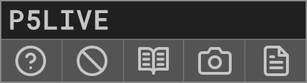
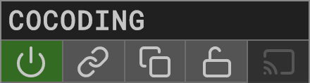
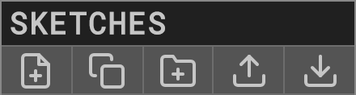

P5LIVE
-------------------------------
v 1.1.0  
cc [teddavis.org](http://teddavis.org) – 2019  
p5.js collaborative live-coding vj environment!

INSTALL
-------------------------------
- Online: [https://teddavis.org/p5live](https://teddavis.org/p5live)
- Offline: Clone and run via localserver or nodejs (for cocoding).

SHORTCUTS
-------------------------------
- `CTRL + N` » new sketch
- `CTRL + ENTER` » compile
- `CTRL + A` » autocompile toggle
- `CTRL + E` » editor toggle
- `CTRL + F` » fullscreen toggle
- `CTRL + M` » menu toggle
- `CTRL + R` » references toggle
- `CTRL + C` » cursor toggle
- `CTRL + T` » tidy code
- `CTRL + -` » decrease fontsize
- `CTRL + +` » increase fontsize
- `CTRL + S` » save png
- `CTRL + 1,2,3...0` » load first 10 sketches

LOCALSTORAGE
-------------------------------
Sketches are ONLY stored in your browser's localStorage.  
Clearing browser history/data will probably erase all sketches.  
Export sketches/folders often.

GETTING STARTED
-------------------------------
  
Start New Sketch via GUI icon or `CTRL + N` and start coding!  
Live-coding active by default, `CTRL + ENTER` to force recompile.  
Sketch is auto-saved on every keystroke.  
  
#### P5LIVE MENU  
  
- About, what you're reading now.  
- Reset, re-initialize P5LIVE (erases sketches/settings).  
- Reference, toggle p5.js reference list.  
- Save PNG, export image.  
- Save HTML, export single-page website.

#### COCODING MENU  
  
- Start, click the single 'network' button.  

  
- Stop, click the green 'network' button.  
- Link, click to share URL with friends.  
- Clone sketch, saves state of cocoding sketch to local sketches.  
- cocodeLayers, replaces code with built-in layers sketch.
  
#### SKETCHES MENU 
  
- New sketch.  
- Clone sketch, duplicates active sketch.  
- New folder, used to nest sketches/folders within others.  
- Import, select JSON files from export (single/folder/all).  
- Export, exports entire sketches list as JSON for import.  
  
#### SKETCH  
  
Load, click on sketch name.  
Rename, click pencil icon and type new name.  
Export, click download icon to export sketch as JSON file.  
Remove, click trash icon and confirm deletion.  
Sort, click + hold + drag to desired order.  
Add to folder, careully drag + drop into/over folder.

#### FOLDER  
  
Expand/collapse, click on folder name.  
Rename, click pencil icon and type new name.  
Export, click download icon to export contents as JSON file.  
Remove, click trash icon and confirm deletion.  
Sort, click + hold + drag to desired order.  
  
#### SETTINGS  
Check short-cuts above for faster toggling:  
- Live Coding, (auto-compiling mode), recompiles on error-free keyup.  
- Fullscreen, toggle fullScreen(), ideal for VJing.  
- Eco Render, toggle loop()/noLoop() if browser window is inactive.  
- Cursor, toggle visibility of cursor when hiding editor.  
- Console, toggle visibility of console incase of errors/warnings.  
- Menu Tab, toggles menu tab. (hide if visible while VJ'ing).  
- Font Size, adjust size of editor text.  
- Background, toggle + set color behind each line of code.  
- Theme, select custom styling of code.
	
#### SNIPPETS  
Add custom snippets to '/includes/demos/P5L_snippets.json'.  
Load snippets via shortcut, CTRL + SHIFT + key  
- CTRL + SHIFT + A, adds audio-reactive code.

#### ASSETS
Want custom assets (fonts/images)?   
Clone/download from github and host locally using MAMP server (or nodejs for cocoding).  
Drop files into folder and link relatively, ('data/fish.png')

#### MISC
Fan going nuts?  
Set `pixelDensity(1);` in `setup()` if on a retina display.

Bug?!  
Add #bug to URL, to enter safemode and disable compiling.

FUNCTIONS
-------------------------------
Additional custom functions have been added:  
- `ease(inVal, outVariable, easeVal)`  smooth values  
- `println(foo)` for compatibility with Processing.  
- `frameCount`, `mouseX`, `mouseY` are continous per recompile.

FUTURE
-------------------------------
- [ ] audio variables (easedAudio, fft bands)
- [ ] export video/gif
- [ ] api (get request for sketch loading)
- [ ] additional js libs for extended coding
- [ ] assets (way of dealing with remotely)
- [ ] autosuggest for p5.js functions
    

TOOLS USED
-------------------------------
P5LIVE is only possible to do these amazing open-source tools:  

- [p5.js](https://p5js.org), magic – v0.8.0
- [ace editor](https://ace.c9.io), code editor on top
- [peeredit / rga.js](https://github.com/jorendorff/peeredit), syncing text for cocoding
- [socket.io](https://socket.io/), websockets for cocoding
- [sortablejs](https://github.com/SortableJS/Sortable), drag + drop sorting of sketches/folders
- [beautify](https://github.com/beautify-web/js-beautify), tidy code in editor
- [jscolor](http://jscolor.com/), color picker for background
- [tippy](https://atomiks.github.io/tippyjs/), tooltips
- [download.js](http://danml.com/download.html), exporting html file
- [vex](https://github.com/HubSpot/vex), custom dialog boxes
- [markdown.js](https://github.com/cadorn/markdown-js), parsing this readme into about section
- [Roboto Mono](https://github.com/google/roboto), font
- [Feather Icons](https://feathericons.com), gui icons  
- [glitch.com](https://glitch.com), nodejs hosting

INSPIRATION
-------------------------------
- [cyril](https://github.com/cyrilcode/cyril)
- [Hydra](https://github.com/ojack/hydra)

SOURCE
-------------------------------
- [github](https://github.com/ffd8/p5live)