# P5LIVE
v 1.3.7  
cc [teddavis.org](http://teddavis.org) – 2019 - 2021  
p5.js collaborative live-coding vj environment!


## SHORTCUTS (default)
- `CTRL + N` » new sketch
- `CTRL + ENTER` » softCompile
- `CTRL + SHIFT + ENTER` » hardCompile
- `CTRL + E` » editor toggle
- `CTRL + M` » menu toggle
- `CTRL + A` » autocompile toggle
- `CTRL + ,` » settings toggle
- `CTRL + R` » references toggle
- `CTRL + B` » chalkboard toggle
- `CTRL + T` » tidy code
- `CTRL + SPACE` » autocomplete
- `CTRL + -` » decrease fontsize
- `CTRL + +` » increase fontsize
- `CTRL + S` » save png [ + code ]
- `CTRL + I` » 720*720px popup for screen-recording
- `CTRL + 1, 2, 3...0` » jump between first 10 sketches


## SAVING
Sketches are **_ONLY_** saved in your browser's localStorage..!  
Export all () sketches + settings regularly.  
Clearing browser history/data will likely erase all sketches + settings.

localStorage is unique and isolated per http[s] / domain / port,  
so export/import all sketches to migrate between online / offline / browsers.  
You can now use `Settings Panel`» `Backup` » `Now` to export all settings + sketches.

*The file structure changed in v1.3, so make sure all copies of P5LIVE are up to date.  
You can import old sketches, but newly saved ones won't open in versions < 1.3.*

#### Automatic Backups
See `Settings Panel` » `Backup` to automatically export a P5LIVE backup file at varying intervals.  
If using [Fancy (nodejs) Offline Server](https://github.com/ffd8/P5LIVE#offline-server), it will save these backups to your P5LIVE folder rather than downloads.


## INSTALL
Online: [p5live.org](https://p5live.org)

Offline: [github.com/ffd8/p5live](https://github.com/ffd8/P5LIVE#offline-server)   
Details below to run via python webserver or nodejs/npm.


## GETTING STARTED
### LIVE-CODE IN 3... 2... 1...  
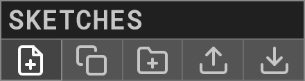  

-  Create New Sketch or `CTRL + N` and start coding!  
- Live-coding active by default, `CTRL + ENTER` to force recompile.  
- Sketches are auto-saved to localStorage on every keystroke.  
  
## MENU
### P5LIVE PANEL 
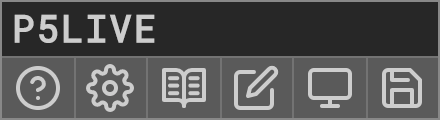  

-  About, 👋 you're reading me now.  
-  Settings, adjust editor settings + shortcuts.  
-  Reference, `CTRL + R`, toggle embeded p5.js reference.  
-  Chalkboard, `CTRL + B`, toggle chalkboard over for annotations.  
-  Visuals-only Popup, for projecting canvas output without code + interace.  
-  Export, click to reveal sub-menu:  


-  Save .png, `CTRL + S`, exports image [+ code if active in settings].  
-  Share code as URL link (refers to online version at p5live.org).
-  Save .html, export single page website (re-link paths to any offline assets).

### SETTINGS PANEL  
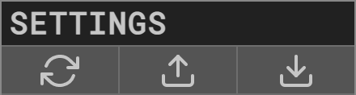

-  Reset Settings to defaults
-  Import Settings
-  Export Settings
  
#### Options
- [x] Live Coding, [500ms], auto-compile error-free code on keyup, with set delay.  
- [x] Eco Render, noLoop() if window loses focus (save computer resources).  
- [x] Console, display console messages (print / errors / warnings).  
- [x] Menu Tab, toggle menu tab. (hide if visible while VJ'ing). 
- [x] Snapshot Code, export current code with each image snapshot. 
- [x] Line Numbers, display code line numbers (and gutter features). 
- [ ] Auto Autocomplete, useful for learning, just use `CTRL + SPACE` as needed. 
- [x] Lock Code on Drag, locks code editor on mouse drag to prevent displacing code. 
- [ ] Pass Editor Keys, keypresses from editor to p5 canvas (hide editor otherwise).
- [x] Notifications, display notifications (shortcut settings + chat). 
- [x] Tooltips, displays extra info on hover. 
- [x] Multi-P5LIVE Warning, if P5LIVE opened multiple times (otherwise sync issues). 
- [x] Timestamp Exports, adds _YYYYMMDD_HHMMSS to filenames.  
- [x] Backup COCODING, Autosave session code if server connection lost.  
- Code Size, `15pt` adjust font size of editor.  
- Code Background, [x] toggle + set color behind lines of code.  
- Code Theme, [Green on Black], select custom styling of editor.
- Code Keybinding, [ace], select alternative keybindings of editor.
- Backup, [off], saves/downloads P5LIVE (sketches + settings) at intervals. `Now` - on demand.  

#### Shortcuts
Customize keyboard shortcuts by clicking on name + press a new key combination.  

#### Reset P5LIVE
-  Completely reset P5LIVE (*deletes all sketches + settings!*) - Don't forget to export sketches first.

### COCODING PANEL
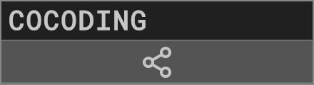  

See dedicated COCODING section below for details.
  
### SKETCHES PANEL 
  

-  New sketch.  
-  Clone sketch, duplicates active sketch.  
-  New folder, nest sketches/folders within others.  
-  Import, select JSON files from export (single/folder/all).  
-  Export, exports entire sketches list for import/backup.  
  
#### Filter
  
  

Lost the overview of your sketches?  
Type in keywords to match names of sketches and folders, filtering only those results. Use separate words for an *and* search, ie. `3d webgl text`. To organize, add a new folder containing that word, and drag + drop items into it. 

#### Sketch  
  
  

- Load Sketch, click on name.
-  Hover to view contextual options  
	-  Inspect,  view/edit code as popup.  
	-  Rename, give sketch new name.  
	-  Export, export single sketch as JSON file.  
	-  Remove, delete sketch after confirmation.  
- Sort, click + hold + drag to desired order.  
- Place in folder, slowly drag + drop into/over folder.

#### Folder  
  
  

- Expand/collapse Folder, click on name.  
-  Hover to view contextual options  
	-  Rename, give folder new name.  
	-  Sub-folder, create a new folder within existing one.
	-  Export, export folder + contents as JSON file.  
	-  Remove, delete folder + contents after confirmation.  
- Sort, click + hold + drag to desired order.  
  
## FEATURES
### COMPILING
There are two modes of compiling in P5LIVE:  

- softCompile, `CTRL + ENTER`, (default) replaces changed functions (smooth refresh).  
- hardCompile, `CTRL + SHIFT + ENTER`, forces entire sketch to recompile.  

Changes to global variables and `setup()`/`preload()` automatically perform a hardCompile since the entire sketch needs it. If your change only occurs within the `draw()` and custom functions (that aren't used in `setup()`), you should see a smooth transition. This is especially useful if using preloaded assets or drawing without a background during a performance, as it allows things to keep flowing. `Classes` are also softCompiled, but remember that each instance will still hold the old variables/methods, so replace each instance to see changes. 

A recompile when nothing has changed (and `live-coding` active), triggers a hardCompile, which is useful for clearing the background or class instances.

If in doubt or not seeing changes, run a hardCompile, `CTRL + SHIFT + ENTER`. 

`frameCount`, `mouseX`, `mouseY` are continous per recompile for smooth refreshes.
	
### AUTOCOMPLETE
Custom autocomplete with p5.js functions and constants has been implemented!  

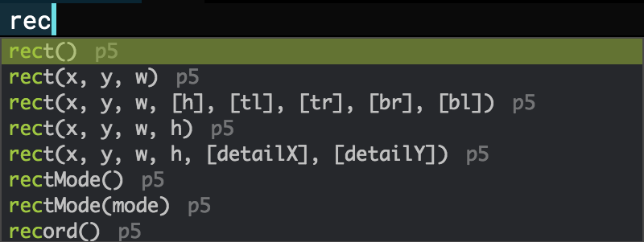  

To activate, enter the first few characters of a function and press `CTRL + SPACE`, then select function alone or with parameters. If selecting with parameters, use `TAB` to cycle through each one. Optionally activate `Auto Autocomplete` in the `Settings` to have suggestions on every keystroke.  

The auto-compiler of `live-coding` pauses whenever the auto-complete panel is active.

If you forget the name of a function, simply view the p5.js references `CTRL + R`.

### REFERENCES
After an overhaul, the built-in  `References`, `CTRL + R`, now include nearly all information found on the official [p5.js reference website](https://p5js.org/reference/), embedded for easy lookup while potentially VJ'ing... meta-visuals! Use the   to surprise yourself and view a random reference.

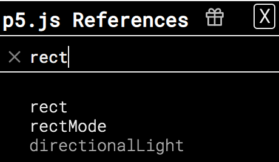  

Use `Search...` with keyup instant filtering to find functions you're after.  
Separate words for an *and* search, ie. `material light`.  
References keep full opacity once viewed, helping note which ones you've read. 

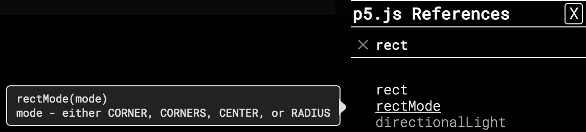  

Hover over functions for `parameters` tooltip, click to read the full detailed reference. 

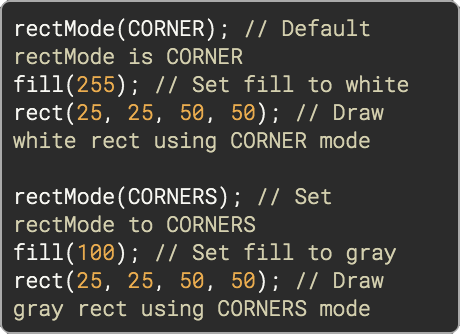  

Beyond params and descriptions, the example's code is now embedded with js highlighting.

### CHALKBOARD
Teaching a class with P5LIVE and need to explain a mathematical concept or highlight code?  
Toggle a  Chalkboard from the P5LIVE Panel or shortcut `CTRL + B`.


Use `DRAWINGS` pulldown to activate 1 of 10 isolated layers to draw on. All drawings remain until either pressing the `🗑️` clear button, DELETE key or refreshing the page. Adjust `COLOR`, `WEIGHT`, `OPACITY` of the *CHALK*, separately adjust the `COLOR` and `OPACITY` of the board (background). This enables you to completely cover up the editor/visuals below for explaining concepts. Dim the *BOARD* if annotating or highlighting code (dim opacity of *CHALK*).

You can even access the drawings within your p5 sketch!  

```
p5live.chalkboard() // grabs active drawing
p5live.chalkboard(#) // grab specific drawing (0 – 9)
```
This drawing can then be displayed and played with as a manual drawing layer within your sketch:

```
image(p5live.chalkboard(), 0, 0);
```
For examples, see `DEMOS` » `_CANVAS` » `_canvas_chalkboard` + `..._animation`


### SNIPPETS  
Add custom snippets to '/includes/demos/P5L_snippets.json'.  
Load snippet via custom shortcut, `CTRL + SHIFT + key`  

- `CTRL + SHIFT + A`, adds audio-reactive code.  
- `CTRL + SHIFT + O`, adds OSC communication code.

### LIBRARIES
P5LIVE loads p5.js/p5.sound libraries by default. For additional libraries, load them remotely via [CDN host](https://www.jsdelivr.com/) or locally if running offline (ie. `/data/libs/`). Can also be used within `SyncData`!  

Add this snippet to the top of your sketch, placing one path per array item:  

```javascript
let libs = [
	""
	,""
];
```

### HYDRA
[hydra-synth](https://github.com/ojack/hydra-synth) has been added to the P5LIVE libs and extra support has been added for writing hydra code in the global space. After importing the library, any changes made within the following tags:  

```js
// hydraSandbox
osc().out() // ... your hydra code here
// hydraSandbox
```
– will only update the hydra-synth engine and won't effect p5 recompiles! Be sure to see DEMOS » _HYDRA for details and various ways of using it in your sketches.

### ASSETS
Loading custom assets (image/font/obj/audio/...):  
 
- Remotely from a [CORS](https://enable-cors.org/resources.html) friendly server ([imgur](https://imgur.com)/[glitch.com](https://glitch.com) images/videos, [GitHub](https://github.com) raw for ~anything)  
`loadImage('https://i.imgur.com/ijQzwsx.jpeg');`
- Locally, if running offline (ie. `/data/images/`)  
`loadImage('data/images/fish.png');`

### VIEW ONLY MODE
By special request (P5LIVE for remote meditation sessions?!), there's a `view only mode`, meaning everything is hidden (code + menu) and you'll only see the sketch running. Intended for COCODING sessions, where the admin can live-code while attendees enjoy and optionally interact with the visuals using their own mic or mouse. Anytime code is recompiled, the same happens here too. Add `edit=0` to your URL:  
- COCODING, `/?cc=*****&edit=0`  
- Solo, `/?edit=0`

You can also load a sketch by URL (for media installation), just add `sketch=name_of_sketch` !  
Example: [\_meta\_P5LIVE](https://p5live.org/?sketch=_meta_P5LIVE)

### VISUALS-ONLY POPUP
Incase you want to project or stream the visuals-only (no code + interface) from P5LIVE, press  within the P5LIVE Panel to launch a popup with a video feed of your P5LIVE canvas. 

### EXPORT / IMPORT
Beyond exporting all sketches regularly (**_backup!_**) – you can export single sketches and/or entire folders (click the export icon next to their name). To re-import, click the import button in the Sketches panel or simply `drag + drop` the `P5L_*****.json` into the browser.

See `Settings Panel` » `Backup` to automatically export a P5LIVE backup file at varying intervals.  

### PERFORMANCE
Lagging or retina display creates too large of a canvas?  
Use `pixelDensity(1);` in `setup()`.

### MIDI/OSC
- MIDI works online/offline and is implemented with webmidi.js  
For example, *demos/_input/_input_midi*
- OSC works offline when using node.js/npm.  
For example,  *demos/_input/_input_osc* and run Processing sketch, [p5live\_osc\_setup](https://gist.github.com/ffd8/f9f33cc7461f8467f62d5a792dde53ca)  
or use the OSC snippet (`CTRL + SHIFT + O`) and set host/in/out ports.  

### BUG/CRASH?! 
Infinite loop? Broken code? P5LIVE now ships includes an infinite loop breaker, thus rendering previous tricks more or less obsolete... nevertheless, these may still be useful:

- Add `#bug` to URL and press `ENTER`.  
Stops compiler, loads a new sketch and opens inspector to fix issue and save.
- Add `#new` to URL and press `ENTER`.  
Loads a new sketch.
- If the browser has completely hung, (rare issue between MBP/Chrome/libraries)  
`sudo killall coreaudiod` (first take off headphones + turndown stereo!)

*Incase you need a loop to run more than 10000 times ||  1 second,  
add `// noprotect` anywhere in your code.*

### EXTRA FUNCTIONS
Additional custom functions are available in P5LIVE sketches:  

- `ease(inValue, outVariable, easeValue)`  smooth values.  
- `println(foo)` Compatibility with Processing.  
- `windowResize()` is set by default to keep your sketch fullscreen. To disable, add `windowResized = null;` in the setup() or overwrite with custom function.


## COCODING 
#### COCODING PANEL DETAIL
  

-  Press to start a COCODING session and share new URL with friends.  

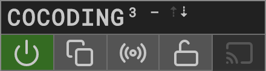  

- COCODING <sup>#</sub> of users - ⇡⇣ syncing up/down-stream.
-  Exit, click the green 'power' button.  
-  Clone sketch, saves current co-code to local sketches within session folder.  
-  SyncData, custom code to sync local data (mouse, midi,...) with peers.  
-  Lockdown (admin), limit editing, toggle write privledges per user.  
-  Broadcast (admin + lockdown), sync mouseX/Y/frameCount/recompile with users.

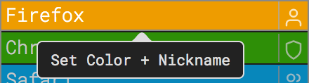  

- Click on your name (very top) to select a new nickname and color.
- If  admin left, you'll have option within this panel to claim it.

#### Lockdown (user)
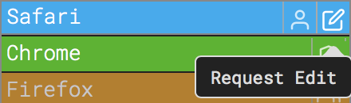  

- Request write-access, click edit button and wait for admin to allow.

#### Lockdown (admin)
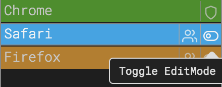  

- Grant write-access, toggle requested write-access from glowing users.

  

- Toggle write-access, admin can always toggle write access per user. 

#### Chat
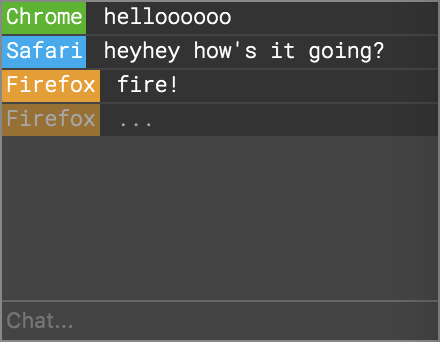   

Within chat, links are parsed, ie. share sketch from p5.js editor.  
Incoming chats displayed as notification (if active) when menu is hidden.

#### SyncData
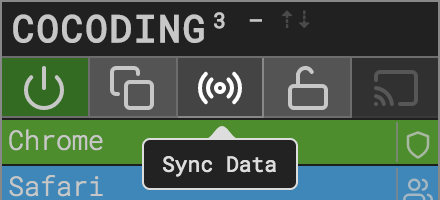  

 launches SyncData window.  

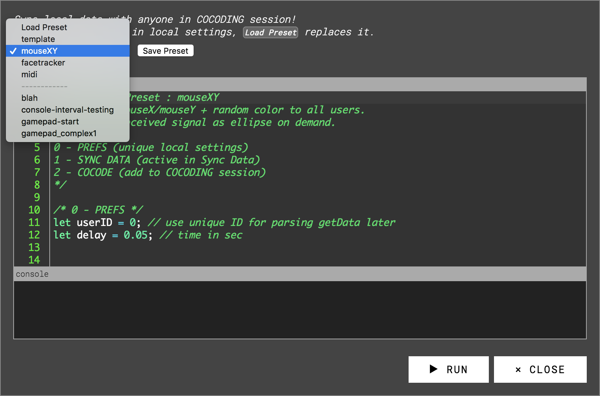   

Use the SyncData window to send local data (as objects), by entering custom code that's executed locally in parallel to the shared COCODING session. Latest changes to the SyncData editor are stored in your local settings. Selecting a new preset replaces its contents, so use `Save Preset` to store anything long-term.  

**Presets**  

- `template` guide for making your own.  
- `mouseXY`, `facetracker` + `midi`, shares those signals with others.  
Be sure to enter unique `userID`'s.
- `Save Preset` for storing current SyncData editor (pre-existing name replaces it).
- `Remove Preset` is available after selecting a custom preset.

**Buttons**  

- `► RUN` activates SyncData, injecting code at end of COCODE on each recompile.
- `► RE-RUN` updates any changes made within SyncData editor.
- `↓ COCODE` (admin) adds code following `/* 2 - COCODE */` into COCODING session.
- `◼ STOP` deactivates SyncData (stops adding local code to recompile).

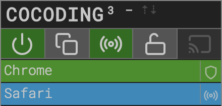 

When active, your own  turns green, along with any user who is sending data.  
 Lockdown mode, suspends SyncData for all users, unless given write-access.  

All data sent, uses `parseData()` in COCODING session to access it. Events can be fired immediately, or pass values to global vars for use within `draw()`. Furthermore you can use `getData()` within COCODING session, for unique local processing within your own SyncData window and code. See `midi` preset for use-case, where `midiThru` receives incoming signals and passes them onward to your own gear.

Be kind to your peers, keep data size and intervals within reasonable values.  
Have fun COCODING with keyboards, EEG-headsets, eye-trackers, ....?! 


## OFFLINE SERVER
### Basic - Python  
Use for quickest setup or to run multiple instances (each with their own sketches storage).  
NO COCODING + OSC with this technique.  

- Clone / Download [P5LIVE](https://github.com/ffd8/p5live)  
- MacOS – open `Terminal` // Windows – open `command prompt`  
- type `cd` + `SPACEBAR` + drag/drop P5LIVE folder into window, press `ENTER` 
- check Python version, type `python --version`, press `ENTER` 
	- `Python 2.0+`, type `python -m SimpleHTTPServer 5000`, press `ENTER`    
	- `Python 3.0+`, type `python -m http.server 5000`, press `ENTER`    
- P5LIVE is live! visit » [http://localhost:5000](http://localhost:5000)
- To quit, `CTRL + C` in Terminal (or command prompt)

Port `5000` is suggested, for alternative, just type desired one in snippet above and remember P5LIVE sketches are stored in localstorage which is unique per `domain:port`

### Fancy - nodejs/npm  
Use for all features (COCODING + OSC) + optional HTTPS mode. 
  
- Clone / Download [P5LIVE](https://github.com/ffd8/p5live)  
- Install Node.js + NPM ([binary installers](https://nodejs.org/en/download/))  
- MacOS – open `Terminal` // Windows – open `command prompt`  
- type `cd` + `SPACEBAR` + drag/drop P5LIVE folder into window, press `ENTER`  
- type `npm install`, press `ENTER`  
- type `npm start`, press `ENTER`  (for custom port: `npm start ####`)
- P5LIVE is live! visit » [http://localhost:5000](http://localhost:5000)
- To quit, `CTRL + C` in Terminal (or command prompt)

Port `5000` is suggested, for alternative, add desired port number to start command above, ie: `npm start 5010`. Remember P5LIVE sketches are stored in localstorage which is unique per `domain:port`

### HTTPS
If using **Fancy** offline server, you may want to COCODE with peers on the same local network. With p5.sound always enabled, a `localhost` or `https` connection is now required regardless of mic being active. While you are `localhost`, any connected peers are simply `http`, therefore we can use an http-proxy to tunnel `https` traffic to our `localhost`!

#### Local (same network, works offline):    
- Start P5LIVE with `npm start https`, or custom port `npm start #### https`  
- HTTPS port is automatically 1 digit higher than P5LIVE (5000 » 5001).  
- Share https address displayed in Terminal, ie: `https://xxxxx.local:5001`  
- Connected peers must accept 'unsecure' (self-gen) certificate with `Advanced` button upon loading URL. Certificates are generative + cached, renewing after 60 days.  
- Enjoy Offline Server COCODING!  

#### Remote (anyone across internet w/ [ngrok](https://ngrok.com/docs#getting-started)!):  
- Start P5LIVE offline server (see above)  
- [Download ngrok](https://ngrok.com/download)  
- Open another tab in Terminal, `cd` to the folder containing **ngrok**  
- Type `ngrok http 5000` and press `ENTER` (tunnels to localhost:5000)  
- Check output for forwarding URL to share with remote peers:  
`https://########.ngrok.io`  
- Enjoy Online [Self-hosted] Server COCODING!


## TOOLS USED
P5LIVE is possible thanks to these amazing open-source projects.  
Listed in order of adoption:  

- [p5.js](https://p5js.org), magic – v1.1.9
- [ace editor](https://ace.c9.io), code editor on top
- [peeredit / rga.js](https://github.com/jorendorff/peeredit), syncing text for cocoding
- [socket.io](https://socket.io/), websockets for cocoding
- [sortablejs](https://github.com/SortableJS/Sortable), drag + drop sorting of sketches/folders
- [beautify](https://github.com/beautify-web/js-beautify), tidy code in editor
- [pickr](https://github.com/Simonwep/pickr), color picker
- [tippy](https://atomiks.github.io/tippyjs/), tooltips
- [download.js](http://danml.com/download.html), exporting html file
- [vex](https://github.com/HubSpot/vex), custom dialog boxes
- [marked.js](https://github.com/markedjs/marked), parsing this readme into about
- [Roboto Mono](https://github.com/google/roboto), font
- [Feather Icons](https://feathericons.com), gui icons 
- [loading.io](https://loading.io/css/), css spinning intro loader
- ~~[glitch.com](https://glitch.com), nodejs websocket hosting~~
- [node-osc](https://github.com/MylesBorins/node-osc), osc connection
- [WebMidi.js](https://github.com/djipco/webmidi), midi connection
- [dropzone.js](https://www.dropzonejs.com/), drag + drop importing
- [mousetrap.js](https://craig.is/killing/mice), custom shortcut key bindings
- [loadjs](https://github.com/muicss/loadjs/), in series loading of libs + sketch
- [highlight.js](https://highlightjs.org/), higlighting of p5.js examples
- [http-proxy](https://github.com/http-party/node-http-proxy), https tunneling
- [pem](https://github.com/Dexus/pem), self-generated generative ssl certificates
- [FHNW](https://www.fhnw.ch/), nodejs websockets cocoding-server
- [loop-breaker](https://github.com/popcodeorg/loop-breaker), inifinite-loop protection


## INSPIRATION
- [cyril](https://github.com/cyrilcode/cyril)
- [Hydra](https://github.com/ojack/hydra)


## SOURCE
- [https://github.com/ffd8/p5live](https://github.com/ffd8/p5live)